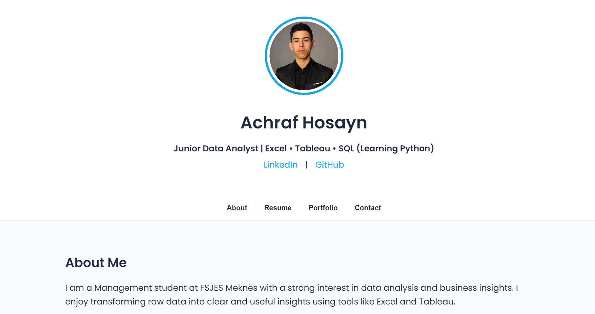

# Achraf Hosayn - Data Analyst Portfolio

# 🌐 Website Preview

This is my personal portfolio website built using HTML, CSS, and JavaScript.

## 👨‍💻 About Me

I am a Management student at FSJES Meknès with a strong interest in data analysis and business insights.

I enjoy transforming raw data into clear and useful insights using tools like Excel and Tableau.

I am currently learning SQL and Python to improve my data analysis skills.

## 📊 Project

### Morocco Startups Analysis

- Data analysis of Moroccan startups using Tableau
- Insights on funding stages, sectors, and top cities
- Interactive dashboard for data visualization

🔗 Project Link:
https://github.com/achrafhosayn/moroccan-startups-analysis

## 🛠️ Tools & Skills

- Excel (Data Cleaning, Pivot Tables)
- Tableau (Dashboards & Visualization)
- SQL (Basic Queries)
- Python (Learning - Pandas)

## 📫 Contact

- Email: hosaynachraf@gmail.com
- LinkedIn: https://www.linkedin.com/in/achraf-hosayn

## ⚖️ License

This project is based on a template by codewithsadee and is licensed under the MIT License.
